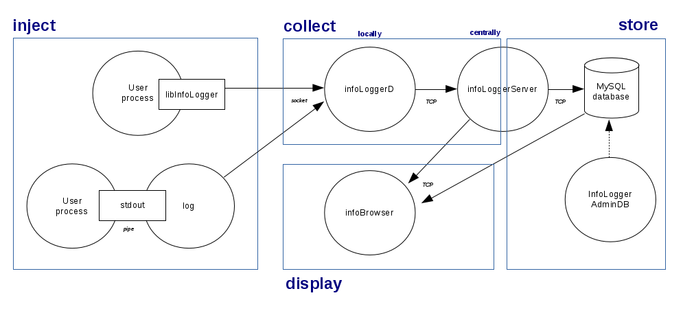

# InfoLogger

This package provides means to inject, collect, store, and display log messages
from processes.


## Architecture

The InfoLogger system consists of several components:

* libInfoLogger.so: C and C++ client APIs to create and inject log messages. It features printf-like
formatting or c++ stream syntax.
* log: a command line tool to inject log messages e.g. from shell scripts, or to redirect program output to InfoLogger.
* infoLoggerD: a daemon running in the background and collecting
all messages on the local node. They are then transported to a central server.
* infoLoggerServer: a daemon collecting centrally the messages sent by
remote infoLoggerD processes. Messages are stored in a MySQL database. It also serves the infoBrowser online clients.
* infoBrowser: a GUI to display online log messages as they arrive on the central server, or to query
them from the database. Messages can be filtered based on their tags.
* infoLoggerAdminDB: a command line tool to create, archive, clean or destroy
the logging database content.





## Installation

Installation described here is for standard CERN CentOS 7 (CC7) operating system
(http://linux.web.cern.ch/linux/centos7/).

Infologger RPM packages can be installed through yum repository.
At the moment, everything is bundled in a single RPM named o2-InfoLogger-standalone, containing all components described above.

Here is an example installation of a fully standalone setup, on a single node (commands executed as root).

* Install InfoLogger RPM:
   * from a local RPM file: `yum install -y ./o2-InfoLogger-standalone*.rpm`      
   * or from a remote YUM repo: `yum install -y o2-InfoLogger-standalone`

* Install a MySQL database. Here we use mariadb, as it's the standard one available in base CC7
install, but other MySQL versions would work just as fine:
  * Setup package:
     `yum install -y mariadb-server`
  * Configure service (start now and at boot time):
     ```
     systemctl start mariadb.service
     systemctl enable mariadb.service
     ```
     
  * Create empty database and accounts for InfoLogger (interactive script, defaults should be fine):
     `opt/o2-InfoLogger/bin/newMysql.sh`
  * Create InfoLogger configuration, and fill with DB access parameters returned by previous script:
     `vi /etc/infoLogger.cfg`

      ```
      [infoLoggerServer]
      dbUser=infoLoggerServer
      dbPassword=uUPrVIY7
      dbHost=localhost
      dbName=INFOLOGGER

      [admin]
      dbUser=infoLoggerAdmin
      dbPassword=eSxUzzlZ
      dbHost=localhost
      dbName=INFOLOGGER

      [infoBrowser]
      dbUser=infoBrowser
      dbPassword=iEJ4w4Yl
      dbHost=localhost
      dbName=INFOLOGGER
      ```

    See also notes below in the "Configuration" section for custom configuration of each component (not necessary for this standalone setup example).

* Create an empty message table in database for infoLoggerServer:
    `/opt/o2-InfoLogger/bin/infoLoggerAdminDB -c create`

* Configure services to start now and at boot time:
    ```
    systemctl enable infoLoggerServer.service
    systemctl enable infoLoggerD.service
    systemctl start infoLoggerServer.service
    systemctl start infoLoggerD.service
    ```

   Default InfoLogger service files for systemd can be found in /usr/lib/systemd/system/ if need to be edited.

* Check status of services:
    ```
    systemctl status infoLoggerServer.service
    systemctl status infoLoggerD.service
    ```


For systems with several nodes, only infoLoggerD and infoBrowser (if necessary) need to be configured (as above) on all nodes. The infoLoggerServer and SQL database
are needed only on one node. Appropriate settings should be defined in infoLoggerD configuration to specify infoLoggerServer host, so that messages can be
collected centrally.


## Usage
* Start infoBrowser:
  `/opt/o2-InfoLogger/bin/infoBrowser &`
    * When launched, it goes in "online" mode, i.e. it connects to the infoLoggerServer and displays messages in real time.
    * To browse previously stored messages, click the green "online" button (to exit online mode), fill-in selection filters, and push "query".
    * Detailed usage of infoBrowser can be found in the historical ALICE DAQ documentation, e.g. at https://alice-daq.web.cern.ch/operations/infobrowser.
      The interface has not changed.

* Log a test message from command line:
  `/opt/o2-InfoLogger/bin/log test`
    * See command line options with `/opt/o2-InfoLogger/bin/log --help`
    * It can be used to redirect output of a process to InfoLogger with e.g. `myProcess | /opt/o2-InfoLogger/bin/log -x`.

* Archive table of messages and create fresh one:
  `/opt/o2-InfoLogger/bin/infoLoggerAdminDB -c archive`
    * See other administartive commands possible with `/opt/o2-InfoLogger/bin/infoLoggerAdminDB -h`

* Compile a sample program using InfoLogger library:
  * (C++ 14):
  `vi myLog.cpp`
  ```
   #include "InfoLogger/InfoLogger.hxx"
   using namespace AliceO2::InfoLogger;
   int main()
   {
     InfoLogger theLog;

     theLog.log("infoLogger message test");
     return 0;
   }
   ```

  ```
  g++ myLog.cpp -I/opt/o2-InfoLogger/include/ -lInfoLogger-standalone -L/opt/o2-InfoLogger/lib -Wl,-rpath=/opt/o2-InfoLogger/lib
  ./a.out
  ```

  * (C):
  `vi myLog.c`
  ```
   #include "InfoLogger/InfoLogger.h"
   int main() {
     InfoLoggerHandle logH;
     infoLoggerOpen(&logH);
     infoLoggerLog(logH, "infoLogger message test");
     return 0;
   }
  ```
  ```
  gcc myLog.c -I/opt/o2-InfoLogger/include/ -lInfoLogger-standalone -L/opt/o2-InfoLogger/lib -Wl,-rpath=/opt/o2-InfoLogger/lib
  ./a.out
  ```

 * More information on the API can be found in the headers /opt/o2-InfoLogger/include and the corresponding
 documentation generated by Doxygen.
 
 * Current list of user-defined tags is limited to severity (Info (default), Error, Fatal, Warning, Debug), but will be expanded soon, through a 'context' option
   which can be specified with each message, to allow setting the other log fields.
 


## Configuration

* Description and example of parameters for each InfoLogger component can be foud in /opt/o2-InfoLogger/etc/*.cfg.
  The parameters can usually be mixed in a single configuration file, as they are grouped in sections ([infoLoggerServer], [infoLoggerD], [infoBrowser], ...).

* On multiple-hosts systems, the serverHost configuration key should be set for infoLoggerD and infoBrowser, so that they are able to connect infoLoggerServer
  if not running locally.

* Client library
  Behavior of infoLogger library can be configured with INFOLOGGER_MODE environment variable.
  This defines where to inject messages at runtime.
  Possible values are:
  * infoLoggerD = inject messages to infoLogger system, through infoLoggerD process (this is the default mode)
  * stdout = print messages to stdout/stderr (severity error and fatal)
  * file = print messages to a file. By default, "./log.txt". Specific file can be set with e.g. INFOLOGGER_MODE=file:/path/to/my/logfile.txt
  * none = messages are discarded
  
  During development phase, it can be useful to set mode to "stdout", to allow using the infoLogger interface
  and printing messages without infoLoggerD/infoLoggerServer.
  When "infoLoggerD" mode is selected and no infoLoggerD connection can be established, the mode falls back to "stdout".
