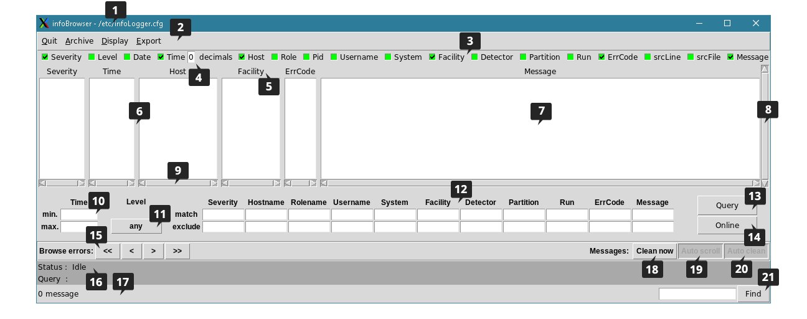

# infoBrowser

Log messages generated by the O2 components can be viewed using the infoBrowser utility.
The infoBrowser allows to explore log messages, as soon as they arrive in the logging system ("online mode"),
or after extraction from the log database ("query mode") with specific search criteria.


infoBrowser is the historical native GUI of the infoLogger system.
It is implemented as a portable Tcl/Tk application.
This app is still fully supported, although there is also a newer [web-based O2 interface](https://github.com/AliceO2Group/WebUi/tree/dev/InfoLogger) providing similar functionality.


# Startup

Start the infoBrowser from the command line, in a X-Windows enabled environment.
Typically:

`/opt/o2-InfoLogger/bin/infoBrowser`


Command-line options:
```
-s severity  : defines a predefined filter on startup
-d detetor   : defines a predefined filter on startup
-p partition : defines a predefined filter on startup
-f facility  : defines a predefined filter on startup
-l level     : defines a predefined filter on startup (use same string as found in select box)
-admin       : enables admin commands for messages archival
-prefs file  : loads on startup a preference file saved previously from the Display menu (geometry, filters, online state)
-z file      : provides path to configuration file (by default: /etc/infoLogger.cfg, or from environment variable INFOLOGGER_CONFIG if set)
```

# GUI

The infoBrowser window looks like this:




The different areas in the _infoBrowser_ window allow to control the selection, visualization and filtering of the currently ongoing operations (_'online'_ mode), or from past operations (_'query'_ mode). All features are decribed below, from top to bottom.

The _infoBrowser_ console uses the configuration settings from the file displayed in the title bar **(1)**.

Each log message consists of several fields (see [main documentation](README.md) for a description of all the tags).

The user can select the visible log fields with the top check buttons **(3)** at any time (even once messages are displayed).
The messages are shown below in a table, with one column per selected field, header on top **(5)**, and one line per message below **(7)**. A vertical scrollbar **(8)** on the right allows to move through the messages when their number exceed the display size (older messages on top, ordered by timestamp in _'query'_ mode, or arrival time in _'online'_ mode).

Each field display width can be tuned by dragging the column separators **(6)**. If needed, there is one horizontal scrollbar at the bottom of each column (mostly used for long values). When clicking in the message area **(7)**, the message full line under the pointer device is highlighted (in yellow). The highlight can be removed by clicking on the same line again.
Multiple lines can be selected by clicking on the first line, and then SHIFT + click on the last line (works also with CTRL + click). Selected lines are automatically copied to the OS clipboard, and the corresponding text can be pasted in other applications, typically with CTRL+V (only visible fields, formatted with TAB separators).

The _Time_ format can be tuned by changing number of decimals **(4)**. Up to 6 decimals can be displayed. This is useful to track events on a given machine, but clocks are rarely synchronized with such a precision across different nodes.

When started, the _infoBrowser_ goes in _'online'_ mode, indicated by the _'online'_ button **(14)** going green (or red if it fails to connect to the server - if so, it will automatically retry at regular intervals). One can enter or exit this mode by clicking the _'online'_ button **(14)**.
In this mode, the _infoBrowser_ connects directly to _infoLoggerServer_ process (if running) and get messages as they arrive. The message list is cleared when switching to _'online'_ mode, and new messages are shown as they are received. New messages are appended to the end of the message list upon reception, so the timestamp order may not be respected. Use the _'query'_ mode to sort messages by time.

To retrieve log messages stored in _infoLogger_ database, click on the _'query'_ button **(13)** (first click on the _'online'_ button **(14)** if it is activated, to exit _'online'_ mode). The status bar **(16)** shows the query and processing status (it can take a few seconds), and the number of messages is written on the bottom line. Messages are ordered by timestamp in _'query'_ mode.

By default, data is taken from latest archive (the main table, where _infoLoggerServer_ stores incoming live messages). Archive control is available under _'Archive'_ menu **(2)**. The user can select an archive (_select_), create a new archive (_create_, archive name is based on timestamp of creation and all messages from main table moved to this new table), or remove messages in latest archive (_delete_, which empties messages from main table only). The last two commands are available only when _infoBrowser_ is started in admin mode, and when sufficient privileges are provided by the configuration credentials.

Messages shown in the _infoBrowser_ console can be exported in a text file with the _'Export'_ menu command **(2)**. Only visible fields are saved in the file, and are separated by TABs. The choice is given in the menu to save all messages (displayed or queried), or only those selected. This is the same functionality as the copy-paste, but directly to a file.

Right-click on a message in **(7)** to show a tooltip window with information related to the message class, based on its _error code_, when defined. This applies also to information messages, and may be used to identify certain types of messages. Right-click again (on a message or on the tooltip window) closes the information window. This feature is available only in some production environments.

An interesting feature of the _infoBrowser_ is the filtering capability. One can select or exclude messages which fields match the filter criteria entered by the user in the filter definition area **(12)**. For example, the user can select messages from a given list of machines, and exclude those coming from a specific facility. Message filters can not be changed when in _'online'_ mode (one has to disconnect first), so that all messages displayed match the same filter. Each criteria can be a list of items (separated by spaces). For a message to be displayed, all the criteria (match and exclude) must be met. SQL wildcards can be used to search patterns: use _'%'_ to match any string (instead of usual _'*'_). For example, _%run%_ matches any string having the word _run_ in it. String match is not case sensitive when using MySQL. More details on string matching can be found in [MySQL documentation](https://dev.mysql.com/doc/refman/8.0/en/string-comparison-functions.html) for the _LIKE_ operator. Multiple-words filter items should be enclosed in double-quotes _"_.
Regular expressions are not supported.
Look at the query string displayed in the status area **(16)** when query is executed to ensure the logical operation is what you want.

_Time_ filter **(10)** is available for offline queries only, to select messages for a specific time range (defined from _min._, start time, to _max._, end time). It accepts any date and time format allowed in [Tcl 'clock scan command](https://www.tcl.tk/man/tcl8.5/TclCmd/clock.htm#M25). This includes usual format (e.g. _yy-mm-dd hh:mm:ss_), but also relative times (e.g. _-1hour_, _-10min_, _-1 week_), very useful to query latest messages. This option should be used especially when the message table is large (>100000 messages), to reduce the number of messages and improve the query speed.

Log messages can be filtered based on their intended audience. Select one of the appropriate _'Level'_ in area **(11)**, next to the filter definition. It can be, by increasing order of verbosity, one of: _ops, support, devel, trace, any_, (or a custom integer value to be defined).

The _Display_ menu **(2)** allows to save all display settings (including filters), load them, and clear filters. This is convenient for queries frequently used, or to setup a known working environment on startup (use the -prefs command line option). There is the choice to save all settings, or just one of geometry (position and size of window, list and size of displayed columns, and other buttons states), filters (all filters settings), and state (_'online'_ mode or _'query'_ mode, as defined when saving the settings. If a query state was executed, it is executed again on the new preferences file load. Click _Clean now_ before saving if you don't want the query to be executed on load). 

The _Browse errors_ buttons **(15)** allow to jump to respectively to first, previous, next, and last errors displayed (severity _error_ or _fatal_).
The number of messages displayed (total, and per severity) are reported in **(17)**.

The _Clean now_ button **(18)** clears the display (but all the messages are still kept by the _infoLogger_ system !).
The _Auto scroll_ buton **(19)**, enabled by default, scrolls automatically the view area down to the latest messages.
The _Auto clean_ button **(20)**, enabled by default, automatically clears the message area when a new run is detected.

A _Find_ entry box and button **(21)** allow to do full-text search in the _message_ field of the displayed messages (case sensitive, no wildcards). Clicking on the _Find_ button **(21)** jumps to the next matching message an selects it.

The application can be terminated using the _Quit_ menu command **(2)**, or by the usual means provided by the operating system (e.g. ALT+F4, or clicking on the X top-right symbol).

Several instances of _infoBrowser_ can be launched concurrently.


# Tips

- Log tables may contain millions of entries. Only the first 10000 will be displayed.
- Be specific enough in the query, with appropriate filters, to reduce the number of messages below this limit.
- It is advised to always specify a time range when using the _'query'_ mode. 
- Remember filtering options can not be changed in _'online'_ mode. If you want to insert some values in a filter field, first you have to uncheck the _'online'_ button.
- Use the _%_ character as wildcard in the filter definitions.


